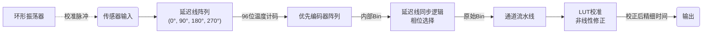

# TDC (Time-to-Digital Converter) 核心架构详解

本文档详细说明了 `TDC_UART` 项目中 TDC 测量核心的内部架构、各子模块功能及信号处理流程。该设计基于 Xilinx 7 系列 FPGA 的 **CARRY4 进位链资源**，采用**四相位插值技术**实现高精度时间间隔测量。

---

## 1. 核心架构概述

本 TDC 采用 **抽头延迟线 (Tapped Delay Line)** 架构。核心思想是利用信号在 FPGA 内部逻辑门（CARRY4）传播时的微小延迟，配合高速时钟和多相位采样技术，将时间信息转换为数字编码。

### 信号流数据路径



---

## 2. 模块详解

### 2.1 延迟线 (`delay_line.v`)

这是 TDC 的物理测量核心，利用 FPGA 的专用进位逻辑链（CARRY4）测量信号相对于时钟边沿的精细位置。

- **CARRY4 原语使用**：
  - 模块通过实例化 `CARRY4` 原语并级联，形成一条长延迟链。
  - 每个 `CARRY4` 包含 **4 个抽头 (CO0-CO3)**，每个抽头代表一级延迟。
  - **`DEPTH` 参数**：定义了 CARRY4 的级联级数。默认为 24 级，共 $24 \times 4 = 96$ 个抽头 (Bins)。
  - > **注**：每个 CARRY4 的延迟约为 53 ps（具体数值依 FPGA 型号和工艺而异）。

- **多相位采样**：
  - 为了消除亚稳态并扩展测量动态范围，延迟线在四个相位的时钟下（**0°, 90°, 180°, 270°**）分别进行采样。
  - 每个 `delay_line` 实例通过参数 `PHASE` 选择采样时钟。

- **输入触发**：
  - 传感器信号 (Hit) 进入链首，随时间沿链传播。
  - 当采样时钟边沿到来时，D 触发器阵列捕获链上状态，形成 **温度计码 (Thermometer Code)**（例如 `...000111...`）。

- **仿真模型**：
  - 包含 `SIM` 宏区分综合代码与仿真代码，仿真模式下使用延迟语句模拟物理传播特性。

### 2.2 优先编码器 (`priority_encoder.v`)

负责将延迟线输出的 96 位温度计码转换为易于处理的二进制数值。

- **三级流水线架构**：
  1.  **Stage 1: 粗定位 (Coarse)**
      - 将 96 位分为 16 组（每组 6 位），快速定位 0/1 跳变发生在哪一组，生成 `cpos` (Coarse Position)。
  2.  **Stage 2: 精细定位 (Fine)**
      - 根据 `cpos` 提取跳变点附近的 12 位数据窗口 (`sslv`)。
  3.  **Stage 3: 最终计算 (Final Calculation)**
      - 计算公式：`bin = cpos * 6 + find_msb(sslv)`。
      - `find_msb` 函数统计 1 的个数，确定精确位置。

- **跨时钟域处理**：
  - 针对 90/180/270 相位的编码器，模块末端包含 CDC（跨时钟域）逻辑，将结果安全地同步回 0 相位主时钟域。

### 2.3 延迟线同步 (`dl_sync.v`)

这是四相位架构的决策中心，用于从四组采样数据中选出最可靠的一组，避免亚稳态和测量死区。

- **原理**：
  - 信号在延迟线上传播需要时间，若跳变刚好发生在时钟采样边沿附近，可能导致亚稳态或误码。
  - 0°、90°、180°、270° 四个采样窗口在时间上互相交错覆盖。

- **判决逻辑**：
  1.  模块并行实例化 4 个 `delay_line` 和 `priority_encoder`。
  2.  **优先检查 0 相位数据**。如果 0 相位捕获到有效跳变且位置安全，则优先使用。
  3.  若 0 相位无效或处于危险区，依次检查 90°、180°、270° 的结果。
  4.  不同相位的结果会加上固定的相位偏移量 (Offset)，归一化到统一的时间轴上。

- **输出**：
  - `bin`: 原始的精细时间测量值（未校准）。
  - `valid`: 数据有效标志。

### 2.4 查找表校准 (`lut.v`)

解决 FPGA 内部布线延迟不均匀导致的非线性问题。CARRY4 的每一级延迟并不完全相等，这会导致测量出现微分非线性 (DNL)。

- **校准方法：码密度测试 (Code Density Test)**
  - 利用非相关信号（如环形振荡器）产生大量随机 Hit。
  - 统计每个 Bin 被命中的次数（直方图）。
  - 延迟大的 Bin 命中的概率更高。

- **工作模式**：
  - `STATE_CLEAR`: 清空直方图 RAM。
  - `STATE_RUN`: 累积测量数据，建立直方图 (Hist RAM)。
  - `STATE_CONFIG`: 计算积分非线性 (INL)，生成查找表 (LUT RAM)。
    - **算法**: `LUT[i] = Sum(Hist[0]...Hist[i]) / Total_Hits * Period`。

- **在线修正**：
  - 在正常测量模式下，输入的原始 `bin` 作为一个地址输入 LUT RAM，直接输出校正后的时间值。

### 2.5 通道顶层 (`channel.v`)

单个测量通道的完整封装，协调数据流。

- **功能**：
  - 实例化并连接 `dl_sync` 和 `lut`。
  - 管理数据流水线 (`valid_pipe`)，确保 LUT 读操作时序正确。
  - **最终计算**：
    - 在校准完成后，读取 LUT 获得归一化系数。
    - 公式：$$ \text{Time} = \frac{\text{LUT\_Data} \times \text{CLK\_Period}}{2^{18}} $$
    - 输出最终的高精度 **13 位时间戳**。

### 2.6 环形振荡器 (`ro.v`)

用于生成校准所需的非相关信号源。

- **结构**：
  - 由奇数个反相器（通过 LUT1 配置成反相器）首尾相连组成的链。
  - 包含一个使能控制端（通过 LUT2 实现与非门/或非门逻辑）。

- **用途**：
  - 当系统进行校准时，开启 RO 产生高速异步时钟，作为 TDC 的输入激励，用于填充直方图。

---

## 3. 关键参数说明 (`tdc_pkg.vh`)

| 参数宏 | 默认值 | 说明 |
| :--- | :--- | :--- |
| `DEPTH` | **24** | CARRY4 级联深度。决定延迟线物理长度。 |
| `BINS_WIDTH` | **96** | 总抽头数 ($DEPTH \times 4$)。 |
| `HIST_SIZE` | **262144** ($2^{18}$) | 直方图累积深度，决定校准精度。值越大统计误差越小。 |
| `CLK_IN_PS` | **3864** | 系统时钟周期 (ps)。260MHz 对应约 3846ps。 |
| `PE_INTBITS` | **9** | 内部 Bin 索引位宽，足以覆盖 4 个相位 $\times$ 96 taps 的范围。 |
| `RO_LENGTH` | **55** | 环形振荡器长度，需为奇数以产生振荡。 |

---

## 4. 资源布局约束 (Constraints)

> **注意：TDC 的性能高度依赖布局布线。**

### 4.1 环形振荡器组合逻辑约束

环形振荡器需要允许组合环路才能正常振荡：

```tcl
set_property ALLOW_COMBINATORIAL_LOOPS true [get_nets -hierarchical -filter {NAME =~ *ro_clk*}]
set_property ALLOW_COMBINATORIAL_LOOPS true [get_nets -hierarchical -filter {NAME =~ *ro_inst*}]
```

### 4.2 TDC Sensor 信号路径延迟平衡约束

为确保四个相位延迟线的采样均衡性，对从 BUFGCTRL 输出到各延迟线 sensor_ff 的路径进行严格的延迟约束 (1.800 ns)：

**UP 通道**：
```tcl
set_max_delay -from [get_pins tdc_uart_inst/signal_mux_inst/up_mux_inst/O] \
              -to [get_pins tdc_uart_inst/channel_up_inst/dl_sync_inst/dl_*/gen_sensor_ff_real.sensor_ff/C] \
              1.800 -datapath_only
```

**DOWN 通道**：
```tcl
set_max_delay -from [get_pins tdc_uart_inst/signal_mux_inst/down_mux_inst/O] \
              -to [get_pins tdc_uart_inst/channel_down_inst/dl_sync_inst/dl_*/gen_sensor_ff_real.sensor_ff/C] \
              1.800 -datapath_only
```

### 4.3 TDC 延迟线物理位置约束

CARRY4 链必须被约束在固定的 SLICE 位置，确保延迟单调性和一致性：

| 通道 | 相位 | SLICE 位置 |
|:-----|:-----|:-----------|
| DOWN | 0° | `SLICE_X0Y0` |
| DOWN | 90° | `SLICE_X10Y0` |
| DOWN | 180° | `SLICE_X20Y0` |
| DOWN | 270° | `SLICE_X30Y0` |
| UP | 0° | `SLICE_X40Y0` |
| UP | 90° | `SLICE_X50Y0` |
| UP | 180° | `SLICE_X60Y0` |
| UP | 270° | `SLICE_X70Y0` |

```tcl
# DOWN 通道
set_property LOC SLICE_X0Y0 [get_cells tdc_uart_inst/channel_down_inst/dl_sync_inst/dl_0/gen_carry0_real.carry4_0]
set_property LOC SLICE_X10Y0 [get_cells tdc_uart_inst/channel_down_inst/dl_sync_inst/dl_90/gen_carry0_real.carry4_0]
set_property LOC SLICE_X20Y0 [get_cells tdc_uart_inst/channel_down_inst/dl_sync_inst/dl_180/gen_carry0_real.carry4_0]
set_property LOC SLICE_X30Y0 [get_cells tdc_uart_inst/channel_down_inst/dl_sync_inst/dl_270/gen_carry0_real.carry4_0]

# UP 通道
set_property LOC SLICE_X40Y0 [get_cells tdc_uart_inst/channel_up_inst/dl_sync_inst/dl_0/gen_carry0_real.carry4_0]
set_property LOC SLICE_X50Y0 [get_cells tdc_uart_inst/channel_up_inst/dl_sync_inst/dl_90/gen_carry0_real.carry4_0]
set_property LOC SLICE_X60Y0 [get_cells tdc_uart_inst/channel_up_inst/dl_sync_inst/dl_180/gen_carry0_real.carry4_0]
set_property LOC SLICE_X70Y0 [get_cells tdc_uart_inst/channel_up_inst/dl_sync_inst/dl_270/gen_carry0_real.carry4_0]
```

> **设计要点**：
> - 各相位延迟线间隔 10 个 SLICE 单元 (X 方向间距)，保持对称布局
> - UP 和 DOWN 通道在 X 方向上分离，减少串扰
> - 所有延迟线都在 Y0 行，确保工艺条件一致

### 4.4 防止综合优化

在 `delay_line.v` 和 `ro.v` 源代码中使用综合属性防止工具优化：

```verilog
(* DONT_TOUCH = "TRUE" *)
(* ALLOW_COMBINATORIAL_LOOPS = "TRUE" *)  // 仅用于 RO
```

