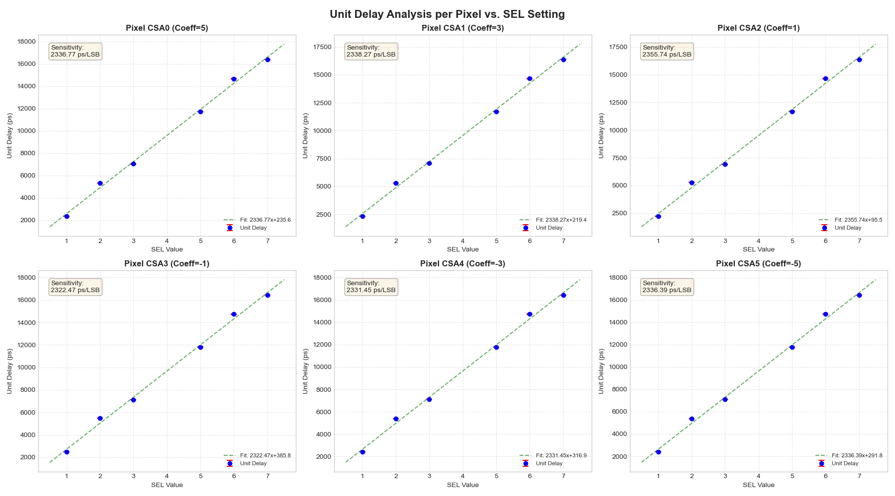
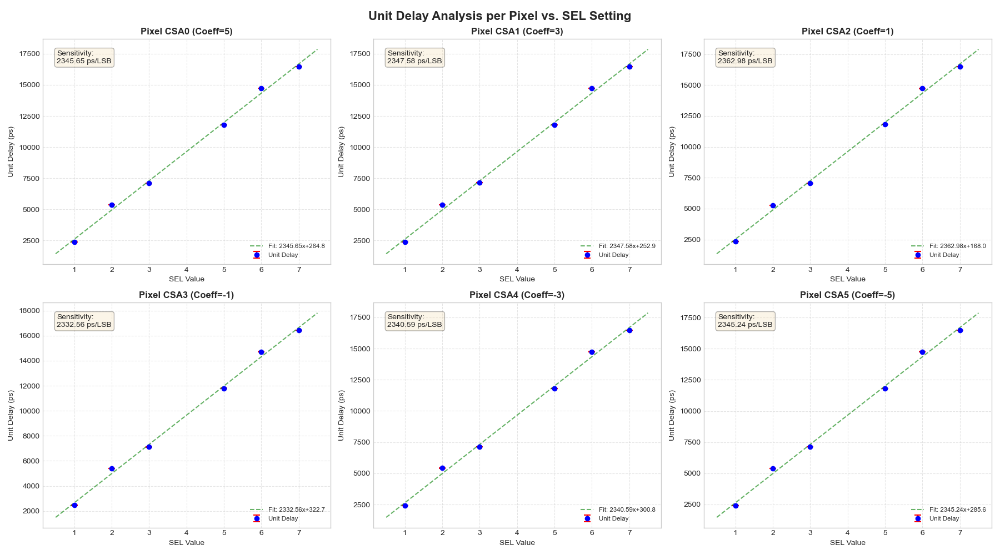
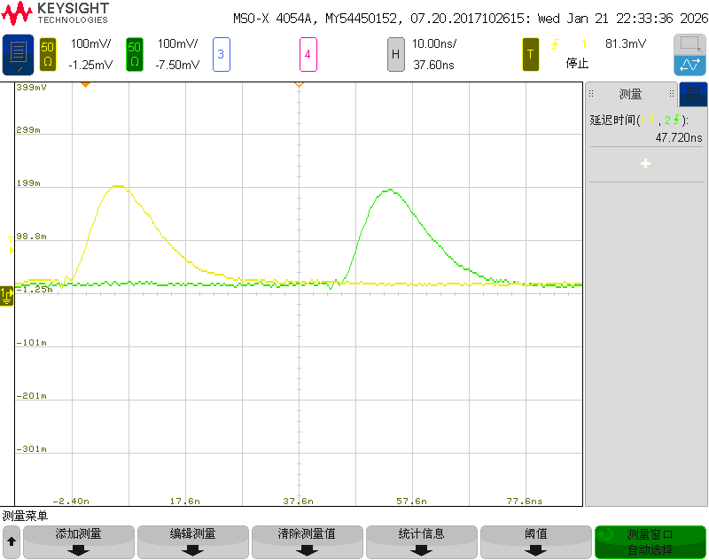
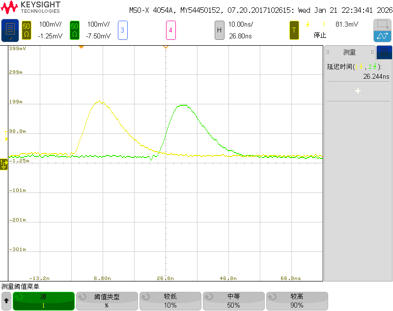
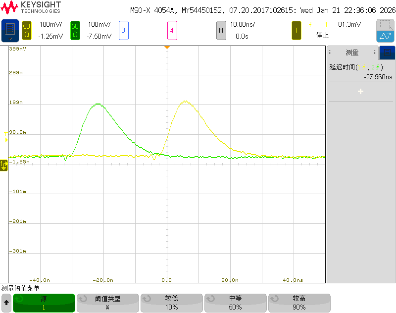
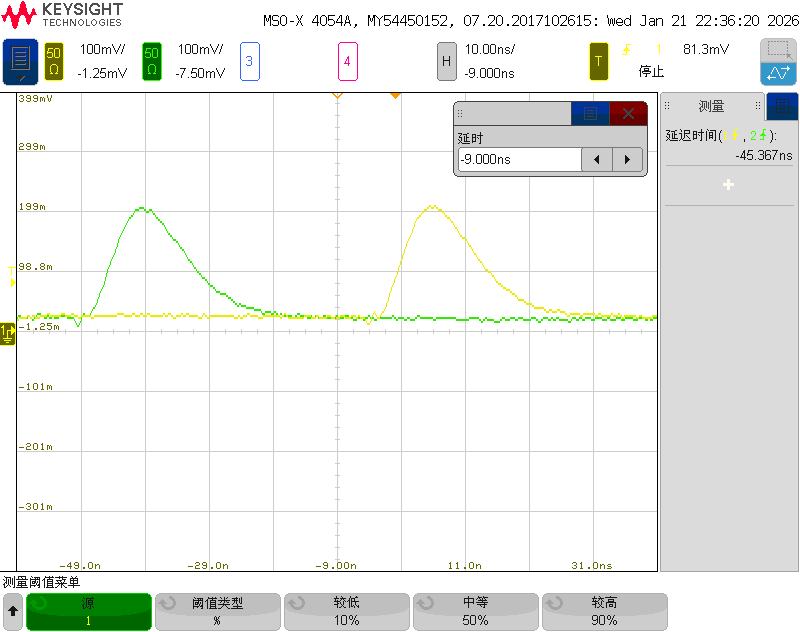
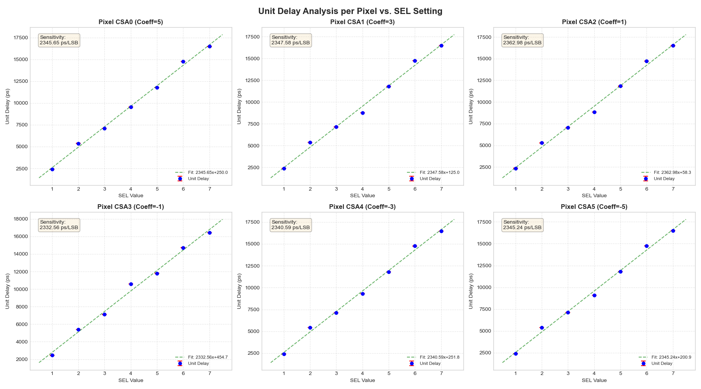

# 数据记录

> 注意：SEL000本身无数据。

## 第一次测试

### 数据信息

#### Merged 数据 (只含有 data.csv 的合并数据)

SEL001 - SCAN_100R_100P_20260108_141721

**Test Mode:** SCAN  
**Timestamp:** 2026-01-08 14:17:21.764595

| Step | CSA   | Samples | Mean (ps)  | Variance | Std Dev (ps) |
|------|-------|---------|------------|----------|-------------|
| 0    | CSA_0 | 10000   | 11837.41   | 157.28   | 12.54       |
| 1    | CSA_1 | 10000   | 6955.51    | 224.47   | 14.98       |
| 2    | CSA_2 | 10000   | 2215.33    | 244.02   | 15.62       |
| 3    | CSA_3 | 10000   | -2492.48   | 244.08   | 15.62       |
| 4    | CSA_4 | 10000   | -7285.21   | 146.60   | 12.11       |
| 5    | CSA_5 | 10000   | -12098.23  | 164.15   | 12.81       |

SEL010 - SCAN_100R_100P_20260108_141454

**Test Mode:** SCAN  
**Timestamp:** 2026-01-08 14:14:54.629893

| Step | CSA   | Samples | Mean (ps)  | Variance | Std Dev (ps) |
|------|-------|---------|------------|----------|-------------|
| 0    | CSA_0 | 10000   | 26645.60   | 172.76   | 13.14       |
| 1    | CSA_1 | 10000   | 15942.25   | 197.63   | 14.06       |
| 2    | CSA_2 | 10000   | 5293.12    | 251.64   | 15.86       |
| 3    | CSA_3 | 10000   | -5483.55   | 212.18   | 14.57       |
| 4    | CSA_4 | 10000   | -16218.55  | 261.02   | 16.16       |
| 5    | CSA_5 | 10000   | -26937.88  | 108.08   | 10.40       |

SEL011 - SCAN_100R_100P_20260108_141252

**Test Mode:** SCAN  
**Timestamp:** 2026-01-08 14:12:52.722446

| Step | CSA   | Samples | Mean (ps)  | Variance | Std Dev (ps) |
|------|-------|---------|------------|----------|-------------|
| 0    | CSA_0 | 10000   | 35184.73   | 291.71   | 17.08       |
| 1    | CSA_1 | 10000   | 21265.76   | 248.06   | 15.75       |
| 2    | CSA_2 | 10000   | 6908.22    | 229.77   | 15.16       |
| 3    | CSA_3 | 10000   | -7113.70   | 218.26   | 14.77       |
| 4    | CSA_4 | 10000   | -21360.07  | 275.07   | 16.59       |
| 5    | CSA_5 | 10000   | -35473.60  | 282.01   | 16.79       |

SEL101 - SCAN_100R_100P_20260108_140819

**Test Mode:** SCAN  
**Timestamp:** 2026-01-08 14:08:19.273744

| Step | CSA   | Samples | Mean (ps)  | Variance | Std Dev (ps) |
|------|-------|---------|------------|----------|-------------|
| 0    | CSA_0 | 10000   | 58587.40   | 328.01   | 18.11       |
| 1    | CSA_1 | 10000   | 35070.71   | 220.50   | 14.85       |
| 2    | CSA_2 | 10000   | 11686.99   | 137.81   | 11.74       |
| 3    | CSA_3 | 10000   | -11804.46  | 156.21   | 12.50       |
| 4    | CSA_4 | 10000   | -35305.03  | 280.29   | 16.74       |
| 5    | CSA_5 | 10000   | -58852.84  | 348.88   | 18.68       |

SEL110 - SCAN_100R_100P_20260108_140613

**Test Mode:** SCAN  
**Timestamp:** 2026-01-08 14:06:13.163075

| Step | CSA   | Samples | Mean (ps)  | Variance | Std Dev (ps) |
|------|-------|---------|------------|----------|-------------|
| 0    | CSA_0 | 10000   | 73326.78   | 235.06   | 15.33       |
| 1    | CSA_1 | 10000   | 43984.16   | 249.05   | 15.78       |
| 2    | CSA_2 | 10000   | 14650.45   | 257.47   | 16.05       |
| 3    | CSA_3 | 10000   | -14734.61  | 221.28   | 14.88       |
| 4    | CSA_4 | 10000   | -44147.25  | 272.99   | 16.52       |
| 5    | CSA_5 | 10000   | -73612.02  | 267.45   | 16.35       |

SEL111 - SCAN_100R_100P_20260108_140335

**Test Mode:** SCAN  
**Timestamp:** 2026-01-08 14:03:35.220836

| Step | CSA   | Samples | Mean (ps)  | Variance | Std Dev (ps) |
|------|-------|---------|------------|----------|-------------|
| 0    | CSA_0 | 10000   | 81854.59   | 390.61   | 19.76       |
| 1    | CSA_1 | 10000   | 49069.78   | 315.44   | 17.76       |
| 2    | CSA_2 | 10000   | 16351.22   | 231.80   | 15.23       |
| 3    | CSA_3 | 10000   | -16423.73  | 236.80   | 15.39       |
| 4    | CSA_4 | 10000   | -49248.87  | 299.77   | 17.31       |
| 5    | CSA_5 | 10000   | -82143.29  | 428.57   | 20.70       |

#### CSA Split 数据 (含有 CSA0-CSA5 分通道数据的分离数据)

SEL001 - SCAN_100R_100P_20260108_150323

**Test Mode:** SCAN  
**Timestamp:** 2026-01-08 15:03:23.868550

| Step | CSA   | Samples | Mean (ps)  | Variance | Std Dev (ps) |
|------|-------|---------|------------|----------|-------------|
| 0    | CSA_0 | 10000   | 11822.94   | 136.23   | 11.67       |
| 1    | CSA_1 | 10000   | 6946.30    | 126.01   | 11.23       |
| 2    | CSA_2 | 10000   | 2213.92    | 196.20   | 14.01       |
| 3    | CSA_3 | 10000   | -2490.24   | 148.17   | 12.17       |
| 4    | CSA_4 | 10000   | -7275.95   | 105.96   | 10.29       |
| 5    | CSA_5 | 10000   | -12084.14  | 144.09   | 12.00       |

SEL010 - SCAN_100R_100P_20260108_150742

**Test Mode:** SCAN  
**Timestamp:** 2026-01-08 15:07:42.633359

| Step | CSA   | Samples | Mean (ps)  | Variance | Std Dev (ps) |
|------|-------|---------|------------|----------|-------------|
| 0    | CSA_0 | 10000   | 26631.94   | 159.49   | 12.63       |
| 1    | CSA_1 | 10000   | 15935.47   | 141.15   | 11.88       |
| 2    | CSA_2 | 10000   | 5288.96    | 225.96   | 15.03       |
| 3    | CSA_3 | 10000   | -5481.13   | 168.60   | 12.98       |
| 4    | CSA_4 | 10000   | -16211.70  | 176.01   | 13.27       |
| 5    | CSA_5 | 10000   | -26924.19  | 103.75   | 10.19       |

SEL011 - SCAN_100R_100P_20260108_150554

**Test Mode:** SCAN  
**Timestamp:** 2026-01-08 15:05:54.382970

| Step | CSA   | Samples | Mean (ps)  | Variance | Std Dev (ps) |
|------|-------|---------|------------|----------|-------------|
| 0    | CSA_0 | 10000   | 35161.87   | 214.85   | 14.66       |
| 1    | CSA_1 | 10000   | 21249.95   | 185.61   | 13.62       |
| 2    | CSA_2 | 10000   | 6903.87    | 126.09   | 11.23       |
| 3    | CSA_3 | 10000   | -7110.41   | 149.78   | 12.24       |
| 4    | CSA_4 | 10000   | -21346.06  | 210.62   | 14.51       |
| 5    | CSA_5 | 10000   | -35452.33  | 208.71   | 14.45       |

SEL101 - SCAN_100R_100P_20260108_151414

**Test Mode:** SCAN  
**Timestamp:** 2026-01-08 15:14:14.992094

| Step | CSA   | Samples | Mean (ps)  | Variance | Std Dev (ps) |
|------|-------|---------|------------|----------|-------------|
| 0    | CSA_0 | 10000   | 58598.29   | 226.18   | 15.04       |
| 1    | CSA_1 | 10000   | 35074.53   | 210.64   | 14.51       |
| 2    | CSA_2 | 10000   | 11687.58   | 127.17   | 11.28       |
| 3    | CSA_3 | 10000   | -11804.49  | 150.87   | 12.28       |
| 4    | CSA_4 | 10000   | -35306.07  | 202.76   | 14.24       |
| 5    | CSA_5 | 10000   | -58854.17  | 250.13   | 15.82       |

SEL110 - SCAN_100R_100P_20260108_150920

**Test Mode:** SCAN  
**Timestamp:** 2026-01-08 15:09:21.059514

| Step | CSA   | Samples | Mean (ps)  | Variance | Std Dev (ps) |
|------|-------|---------|------------|----------|-------------|
| 0    | CSA_0 | 10000   | 73347.67   | 222.75   | 14.92       |
| 1    | CSA_1 | 10000   | 43995.64   | 237.52   | 15.41       |
| 2    | CSA_2 | 10000   | 14653.28   | 172.40   | 13.13       |
| 3    | CSA_3 | 10000   | -14735.75  | 148.98   | 12.21       |
| 4    | CSA_4 | 10000   | -44152.21  | 220.49   | 14.85       |
| 5    | CSA_5 | 10000   | -73620.59  | 248.90   | 15.78       |

SEL111 - SCAN_100R_100P_20260108_151229

**Test Mode:** SCAN  
**Timestamp:** 2026-01-08 15:12:29.540880

| Step | CSA   | Samples | Mean (ps)  | Variance | Std Dev (ps) |
|------|-------|---------|------------|----------|-------------|
| 0    | CSA_0 | 10000   | 81916.04   | 323.14   | 17.98       |
| 1    | CSA_1 | 10000   | 49102.85   | 239.94   | 15.49       |
| 2    | CSA_2 | 10000   | 16363.34   | 155.50   | 12.47       |
| 3    | CSA_3 | 10000   | -16432.14  | 123.28   | 11.10       |
| 4    | CSA_4 | 10000   | -49276.20  | 205.43   | 14.33       |
| 5    | CSA_5 | 10000   | -82184.24  | 321.65   | 17.93       |

#### 数据分析

---

**单位延时分析 - 第一次测试 (2026-01-08)**

**单位延时分析 - 修正后对比 (2026-01-21)**

---

### 数据记录说明

**测试硬件：** 初代测试板  
**测试日期：** 2026-01-08  
**数据类型：** 两组

**主要发现：**
- 无法采集 SEL100 数据，怀疑硬件问题
- 成功采集其他 SEL 配置的完整数据

**数据组成：**
1. **Merged 数据** - 仅包含 data.csv 合并数据
2. **CSA Split 数据** - 包含 CSA0-CSA5 各通道独立数据

## 第二次测试

### 数据信息

- 时间：2026-01-21
- 测试数据：CSA Split
- 注：SEL100 缺失

SEL001 - SCAN_100R_100P_20260121_172647

**Test Mode:** SCAN  
**Timestamp:** 2026-01-21 17:26:47.961069

| Step | CSA   | Samples | Mean (ps)  | Variance | Std Dev (ps) |
|------|-------|---------|------------|----------|-------------|
| 0    | CSA_0 | 10000   | 11989.13   | 93.80    | 9.68        |
| 1    | CSA_1 | 10000   | 7083.89    | 82.24    | 9.07        |
| 2    | CSA_2 | 10000   | 2344.18    | 82.53    | 9.08        |
| 3    | CSA_3 | 10000   | -2456.50   | 94.73    | 9.73        |
| 4    | CSA_4 | 10000   | -7252.38   | 91.81    | 9.58        |
| 5    | CSA_5 | 10000   | -12091.16  | 117.69   | 10.85       |

SEL010 - SCAN_100R_100P_20260121_172841

**Test Mode:** SCAN  
**Timestamp:** 2026-01-21 17:28:41.288427

| Step | CSA   | Samples | Mean (ps)  | Variance | Std Dev (ps) |
|------|-------|---------|------------|----------|-------------|
| 0    | CSA_0 | 10000   | 26882.59   | 113.91   | 10.67       |
| 1    | CSA_1 | 10000   | 16103.95   | 107.02   | 10.35       |
| 2    | CSA_2 | 10000   | 5275.56    | 96.07    | 9.80        |
| 3    | CSA_3 | 10000   | -5394.46   | 108.51   | 10.42       |
| 4    | CSA_4 | 10000   | -16246.74  | 89.51    | 9.46        |
| 5    | CSA_5 | 10000   | -26997.04  | 102.31   | 10.11       |

SEL011 - SCAN_100R_100P_20260121_173049

**Test Mode:** SCAN  
**Timestamp:** 2026-01-21 17:30:49.272076

| Step | CSA   | Samples | Mean (ps)  | Variance | Std Dev (ps) |
|------|-------|---------|------------|----------|-------------|
| 0    | CSA_0 | 10000   | 35470.05   | 132.57   | 11.51       |
| 1    | CSA_1 | 10000   | 21401.14   | 121.46   | 11.02       |
| 2    | CSA_2 | 10000   | 7041.95    | 80.69    | 8.98        |
| 3    | CSA_3 | 10000   | -7104.07   | 90.13    | 9.49        |
| 4    | CSA_4 | 10000   | -21347.91  | 132.44   | 11.51       |
| 5    | CSA_5 | 10000   | -35547.15  | 131.29   | 11.46       |

SEL100 - 示波器测试数据

**Test Mode:** OSCILLOSCOPE  
**Timestamp:** 2026-01-21  
**Note:** SEL100脉冲幅度约 200mV

---

**CSA0 通道 (测量值: 47720 ps)**

**CSA1 通道 (测量值: 26244 ps)**

**CSA2 通道 (测量值: 8852 ps)**

**CSA3 通道 (测量值: -10577 ps)**

**CSA4 通道 (测量值: -27960 ps)**

**CSA5 通道 (测量值: -45367 ps)**

---

**测量数据汇总**

| 通道  | 时间差 (ps) |
|-------|-------------|
| CSA0  | 47720       |
| CSA1  | 26244       |
| CSA2  | 8852        |
| CSA3  | -10577      |
| CSA4  | -27960      |
| CSA5  | -45367      |

SEL101 - SCAN_100R_100P_20260121_173301

**Test Mode:** SCAN  
**Timestamp:** 2026-01-21 17:33:01.628801

| Step | CSA   | Samples | Mean (ps)  | Variance | Std Dev (ps) |
|------|-------|---------|------------|----------|-------------|
| 0    | CSA_0 | 10000   | 58955.12   | 187.81   | 13.70       |
| 1    | CSA_1 | 10000   | 35338.72   | 142.73   | 11.95       |
| 2    | CSA_2 | 10000   | 11828.26   | 112.20   | 10.59       |
| 3    | CSA_3 | 10000   | -11795.52  | 92.89    | 9.64        |
| 4    | CSA_4 | 10000   | -35399.06  | 121.82   | 11.04       |
| 5    | CSA_5 | 10000   | -59046.35  | 200.68   | 14.17       |

SEL110 - SCAN_100R_100P_20260121_173655

**Test Mode:** SCAN  
**Timestamp:** 2026-01-21 17:36:55.768046

| Step | CSA   | Samples | Mean (ps)  | Variance | Std Dev (ps) |
|------|-------|---------|------------|----------|-------------|
| 0    | CSA_0 | 10000   | 73734.26   | 223.46   | 14.95       |
| 1    | CSA_1 | 10000   | 44232.12   | 181.41   | 13.47       |
| 2    | CSA_2 | 10000   | 14728.77   | 94.31    | 9.71        |
| 3    | CSA_3 | 10000   | -14722.61  | 94.14    | 9.70        |
| 4    | CSA_4 | 10000   | -44262.89  | 180.69   | 13.44       |
| 5    | CSA_5 | 10000   | -73844.62  | 221.73   | 14.89       |

SEL111 - SCAN_100R_100P_20260121_173451

**Test Mode:** SCAN  
**Timestamp:** 2026-01-21 17:34:51.170206

| Step | CSA   | Samples | Mean (ps)  | Variance | Std Dev (ps) |
|------|-------|---------|------------|----------|-------------|
| 0    | CSA_0 | 10000   | 82389.86   | 239.30   | 15.47       |
| 1    | CSA_1 | 10000   | 49418.06   | 163.49   | 12.79       |
| 2    | CSA_2 | 10000   | 16501.09   | 118.09   | 10.87       |
| 3    | CSA_3 | 10000   | -16444.45  | 103.70   | 10.18       |
| 4    | CSA_4 | 10000   | -49427.68  | 165.79   | 12.88       |
| 5    | CSA_5 | 10000   | -82470.95  | 227.06   | 15.07       |

#### 数据分析

---

**单位延时分析 - 第二次测试 (2026-01-21)**

> 注：此次测试附带了示波器采集的 SEL100 测试数据

---

### 数据记录说明

**测试硬件：** 重新焊接的新测试板  
**测试日期：** 2026-01-21  
**数据类型：** CSA Split

**重要改进：**
- 修正代码错误：260MHz 对应周期从 3864ps 更正为 3846ps
- 数据标准差显著降低，测量精度提升

**问题分析：**
- SEL100 数据仍无法通过 TDC 采集
- 根本原因：像素芯片输出脉冲幅度过小（约 200mV）
- 脉冲幅度不足以触发 TDC 系统的阈值

**解决方案：**
采用示波器直接测量 SEL100 输出波形时间差（详见上方示波器测试数据）

---

**示波器测量结果总结：**

| 通道  | 时间差 (ps) | 备注          |
|-------|-------------|---------------|
| CSA0  | 47720       | 最大正延时    |
| CSA1  | 26244       |               |
| CSA2  | 8852        |               |
| CSA3  | -10577      |               |
| CSA4  | -27960      |               |
| CSA5  | -45367      | 最大负延时    |

> 注：SEL100 脉冲幅度在示波器下测得约 200mV